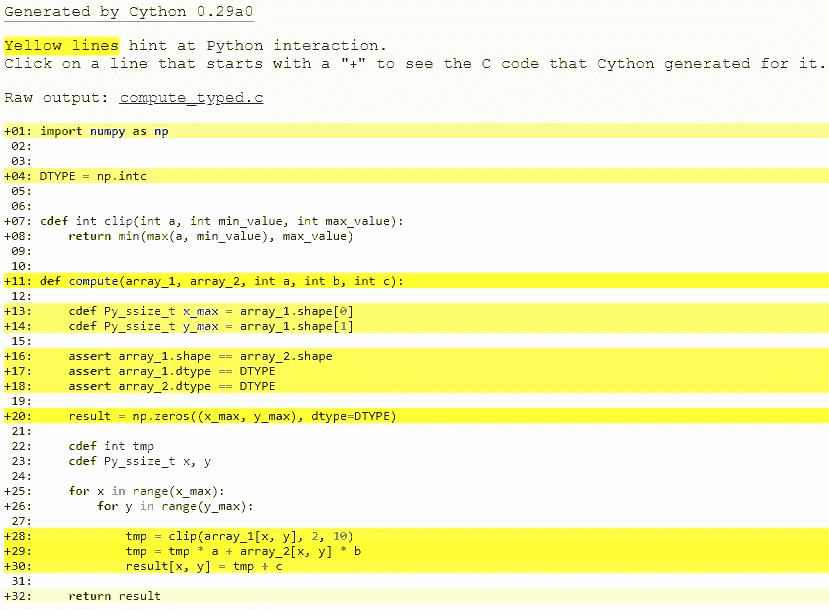

# 用于 NumPy 用户的 Cython

> 原文： [http://docs.cython.org/en/latest/src/userguide/numpy_tutorial.html](http://docs.cython.org/en/latest/src/userguide/numpy_tutorial.html)

本教程针对的是根本没有 Cython 经验的 NumPy 用户。如果您对 Cython 有一些了解，可能需要跳到“高效索引”部分。

考虑的主要方案是 NumPy 最终用途而不是 NumPy / SciPy 开发。原因是 Cython 不能（还）能够以高级方式支持关于维数的通用功能。对于 SciPy 开发而言，这种限制比更具体的“最终用户”功能要严格得多。有关详细信息，请参阅最后一节。

本教程的风格不适合所有人，所以你也可以考虑：

*   Kurt Smith 在 SciPy 2015 上的[视频教程。这次演讲的幻灯片和笔记本是 github](https://www.youtube.com/watch?v=gMvkiQ-gOW8&t=4730s&ab_channel=Enthought) 上的[。](https://github.com/kwmsmith/scipy-2015-cython-tutorial)
*   基本的 Cython 文档（参见 [Cython 首页](https://cython.readthedocs.io/en/latest/index.html)）。

## Cython 一览

Cython 是一个编译器，它将类似 Python 的代码文件编译为 C 代码。不过，''Cython 不是 Python 到 C 的翻译''。也就是说，它不会占用您的完整程序并“将其转换为 C” - 相反，结果充分利用了 Python 运行时环境。一种看待它的方式可能是你的代码仍然是 Python，因为它在 Python 运行时环境中运行，而不是编译为解释的 Python 字节码，而是编译为本机机器代码（但是增加了额外的语法以便于嵌入更快的类 C 代码）。

这有两个重要的后果：

*   速度。多少在很大程度上取决于所涉及的计划。典型的 Python 数值程序往往会获得很少的收益，因为大部分时间花在以高级方式使用的较低级别 C 上。然而，当添加键入信息时，for 循环风格的程序可以获得许多数量级（并且因此可以作为现实替代方案）。
*   轻松调用 C 代码。 Cython 的目的之一是允许轻松包装 C 库。在 Cython 中编写代码时，您可以像使用 Python 代码一样轻松调用 C 代码。

很少有 Python 构造尚不支持，虽然使 Cython 编译所有 Python 代码是一个明确的目标，你可以在 [限制](limitations.html#cython-limitations) 中看到与 Python 的差异。

## 您的 Cython 环境

使用 Cython 包含以下步骤：

1.  写一个`.pyx`源文件
2.  运行 Cython 编译器以生成 C 文件
3.  运行 C 编译器以生成编译库
4.  运行 Python 解释器并要求它导入模块

但是，有几个选项可以自动执行这些步骤：

1.  [SAGE](http://sagemath.org) 数学软件系统为从交互式命令行或笔记本界面（如 Maple / Mathematica）使用 Cython 和 NumPy 提供了出色的支持。参见[本文档](https://doc.sagemath.org/html/en/developer/coding_in_cython.html)。
2.  Cython 可以作为 Jupyter 笔记本中的扩展，使得编译和使用 Cython 代码只需在单元格顶部只有一个`%%cython`。有关更多信息，请参阅 [使用 Jupyter 笔记本](../quickstart/build.html#jupyter-notebook) 。
3.  pythonmport 的一个版本随 Cython 一起提供，因此您可以动态地将 pyx 文件导入 Python 并自动编译（参见 [使用 pyximport](source_files_and_compilation.html#pyximport)进行编译）。
4.  Cython 支持 distutils，因此您可以非常轻松地创建自动化过程的构建脚本，这是 Cython 实现的库和包的首选方法。参见 [Basic setup.py](source_files_and_compilation.html#basic-setup-py)。
5.  手动编译（见下文）

注意

如果使用除 SAGE 之外的其他交互式命令行环境（如 IPython 或 Python 本身），则在重新编译模块时重新启动该进程非常重要。再次发出“导入”声明是不够的。

## 安装

如果您已经有一个 C 编译器，那么就这样做：

```py
pip install Cython

```

否则，请参见 [安装页面](../quickstart/install.html#install) 。

在撰写本文时，SAGE 附带了比本教程所要求的更早版本的 Cython。因此，如果使用 SAGE，您应该下载最新的 Cython 然后执行

```py
$ cd path/to/cython-distro
$ path-to-sage/sage -python setup.py install

```

这将把最新的 Cython 安装到 SAGE 中。

## 手动编译

由于知道发生了什么总是很重要，我将在这里描述手动方法。第一次运行 Cython：

```py
$ cython yourmod.pyx

```

这会创建`yourmod.c`，这是 Python 扩展模块的 C 源代码。一个有用的附加开关是`-a`，它将生成一个文档`yourmod.html`，它显示哪个 Cython 代码逐行转换为哪个 C 代码。

然后我们编译 C 文件。这可能会因您的系统而异，但 C 文件应该像 Python 一样构建。用于编写扩展的 Python 文档应该有一些细节。在 Linux 上，这通常意味着：

```py
$ gcc -shared -pthread -fPIC -fwrapv -O2 -Wall -fno-strict-aliasing -I/usr/include/python2.7 -o yourmod.so yourmod.c

```

`gcc`应该可以访问 NumPy C 头文件，因此如果它们未安装在`/usr/include/numpy`或类似文件中，您可能需要为这些文件传递另一个选项。如果你写的话，你只需要提供 NumPy 标题：

```py
cimport numpy

```

在您的 Cython 代码中。

这会在同一目录中创建`yourmod.so`，Python 可以使用普通的`import yourmod`语句导入该目录。

## 第一个 Cython 程序

您可以通过下载 [Jupyter 笔记本](https://github.com/cython/cython/blob/master/docs/examples/userguide/numpy_tutorial/numpy_and_cython.ipynb)轻松执行本教程的代码。

下面的代码在 numpy 中相当于这个函数：

```py
def compute_np(array_1, array_2, a, b, c):
    return np.clip(array_1, 2, 10) * a + array_2 * b + c

```

我们会说`array_1`和`array_2`是整数类型的 2D NumPy 数组，`a`，`b`和`c`是三个 Python 整数。

这个函数使用 NumPy 并且已经非常快了，所以使用 Cython 再次执行它可能有点过分。这是出于演示目的。尽管如此，我们将证明我们以更加冗长的代价实现了比 NumPy 更好的速度和内存效率。

此代码计算函数，其中循环在展开的两个维度上。它既是有效的 Python 又是有效的 Cython 代码。我将其称为 Python 版本的`compute_py.py`和 Cython 版本的`compute_cy.pyx` - Cython 使用`.pyx`作为其文件后缀（但它也可以编译`.py`文件）。

```py
import numpy as np

def clip(a, min_value, max_value):
    return min(max(a, min_value), max_value)

def compute(array_1, array_2, a, b, c):
    """
 This function must implement the formula
 np.clip(array_1, 2, 10) * a + array_2 * b + c

 array_1 and array_2 are 2D.
 """
    x_max = array_1.shape[0]
    y_max = array_1.shape[1]

    assert array_1.shape == array_2.shape

    result = np.zeros((x_max, y_max), dtype=array_1.dtype)

    for x in range(x_max):
        for y in range(y_max):
            tmp = clip(array_1[x, y], 2, 10)
            tmp = tmp * a + array_2[x, y] * b
            result[x, y] = tmp + c

    return result

```

这应该被编译为为 Linux 系统生成`compute_cy.so`（在 Windows 系统上，这将是`.pyd`文件）。我们运行 Python 会话来测试 Python 版本（从`.py` -file 导入）和编译的 Cython 模块。

```py
In [1]: import numpy as np
In [2]: array_1 = np.random.uniform(0, 1000, size=(3000, 2000)).astype(np.intc)
In [3]: array_2 = np.random.uniform(0, 1000, size=(3000, 2000)).astype(np.intc)
In [4]: a = 4
In [5]: b = 3
In [6]: c = 9
In [7]: def compute_np(array_1, array_2, a, b, c):
 ...:     return np.clip(array_1, 2, 10) * a + array_2 * b + c
In [8]: %timeit compute_np(array_1, array_2, a, b, c)
103 ms ± 4.16 ms per loop (mean ± std. dev. of 7 runs, 10 loops each)

In [9]: import compute_py
In [10]: compute_py.compute(array_1, array_2, a, b, c)
1min 10s ± 844 ms per loop (mean ± std. dev. of 7 runs, 1 loop each)

In [11]: import compute_cy
In [12]: compute_cy.compute(array_1, array_2, a, b, c)
56.5 s ± 587 ms per loop (mean ± std. dev. of 7 runs, 1 loop each)

```

还没有那么大的差别;因为 C 代码仍然完全符合 Python 解释器的作用（例如，意味着为每个使用的数字分配了一个新对象）。

从命令行调用 Cython 时可以使用`-a`查看 Python 交互和生成的 C 代码，使用 Jupyter Notebook 时使用`%%cython -a`，或者在使用`setup.py`时使用`cythonize('compute_cy.pyx', annotate=True)`。查看生成的 html 文件，看看即使是最简单的语句也需要什么。你很快就明白了。我们需要给 Cython 更多信息;我们需要添加类型。

## 添加类型

要添加类型，我们使用自定义 Cython 语法，因此我们现在正在破坏 Python 源兼容性。这是`compute_typed.pyx`。 _ 阅读评论！_

```py
import numpy as np

# We now need to fix a datatype for our arrays. I've used the variable
# DTYPE for this, which is assigned to the usual NumPy runtime
# type info object.
DTYPE = np.intc

# cdef means here that this function is a plain C function (so faster).
# To get all the benefits, we type the arguments and the return value.
cdef int clip(int a, int min_value, int max_value):
    return min(max(a, min_value), max_value)

def compute(array_1, array_2, int a, int b, int c):

    # The "cdef" keyword is also used within functions to type variables. It
    # can only be used at the top indentation level (there are non-trivial
    # problems with allowing them in other places, though we'd love to see
    # good and thought out proposals for it).
    cdef Py_ssize_t x_max = array_1.shape[0]
    cdef Py_ssize_t y_max = array_1.shape[1]

    assert array_1.shape == array_2.shape
    assert array_1.dtype == DTYPE
    assert array_2.dtype == DTYPE

    result = np.zeros((x_max, y_max), dtype=DTYPE)

    # It is very important to type ALL your variables. You do not get any
    # warnings if not, only much slower code (they are implicitly typed as
    # Python objects).
    # For the "tmp" variable, we want to use the same data type as is
    # stored in the array, so we use int because it correspond to np.intc.
    # NB! An important side-effect of this is that if "tmp" overflows its
    # datatype size, it will simply wrap around like in C, rather than raise
    # an error like in Python.

    cdef int tmp

    # Py_ssize_t is the proper C type for Python array indices.
    cdef Py_ssize_t x, y

    for x in range(x_max):
        for y in range(y_max):

            tmp = clip(array_1[x, y], 2, 10)
            tmp = tmp * a + array_2[x, y] * b
            result[x, y] = tmp + c

    return result

```



此时，查看为`compute_cy.pyx`和`compute_typed.pyx`生成的 C 代码。单击这些行以展开它们并查看相应的 C.

特别是看一下`for-loops`：在`compute_cy.c`中，这些是要设置的~20 行 C 代码，而在`compute_typed.c`中使用正常的 C for 循环。

在构建完这个并继续我的（非正式）基准测试后，我得到：

```py
In [13]: %timeit compute_typed.compute(array_1, array_2, a, b, c)
26.5 s ± 422 ms per loop (mean ± std. dev. of 7 runs, 1 loop each)

```

因此添加类型确实使代码更快，但是没有接近 NumPy 的速度？

发生的事情是，在这段代码中花费的大部分时间用在以下行中，并且这些行的执行速度比纯 Python 要慢：

```py
tmp = clip(array_1[x, y], 2, 10)
tmp = tmp * a + array_2[x, y] * b
result[x, y] = tmp + c

```

那么是什么让这些线条比纯 Python 版本慢得多？

`array_1`和`array_2`仍然是 NumPy 数组，所以 Python 对象，并期望 Python 整数作为索引。这里我们传递 C int 值。所以每次 Cython 到达这一行时，它必须将所有 C 整数转换为 Python int 对象。由于这条线经常被调用，它超过了之前从`range()`创建的纯 C 循环的速度优势。

此外，`tmp * a + array_2[x, y] * b`返回一个 Python 整数，`tmp`是一个 C 整数，因此 Cython 必须再次进行类型转换。最后，这些类型的转换会加起来。并使我们的计算非常缓慢。但是这个问题可以通过使用内存视图轻松解决。

## 使用内存视图进行高效索引

仍有两个瓶颈会降低性能，即数组查找和分配，以及 C / Python 类型转换。 `[]` -operator 仍然使用完整的 Python 操作 - 我们想要做的是直接以 C 速度访问数据缓冲区。

我们需要做的是输入`ndarray`对象的内容。我们使用 memoryview 执行此操作。 [中有一个专门用于它的 Cython 文档](memoryviews.html#memoryviews) 中的页面。

简而言之，内存视图是 C 结构，可以保存指向 NumPy 数组的数据的指针以及所有必要的缓冲区元数据，以提供有效和安全的访问：维度，步幅，项目大小，项目类型信息等...它们也支持切片，所以即使 NumPy 数组在内存中不连续，它们也能正常工作。它们可以由 C 整数索引，从而允许快速访问 NumPy 数组数据。

以下是如何声明整数的内存视图：

```py
cdef int [:] foo         # 1D memoryview
cdef int [:, :] foo      # 2D memoryview
cdef int [:, :, :] foo   # 3D memoryview
...                      # You get the idea.

```

在我们的示例中，没有数据从 NumPy 数组复制到 memoryview。顾名思义，它只是记忆的“视图”。因此，我们可以使用视图`result_view`进行有效索引，最后返回保存我们操作数据的真实 NumPy 数组`result`。

以下是如何在我们的代码中使用它们：

`compute_memview.pyx`

```py
import numpy as np

DTYPE = np.intc

cdef int clip(int a, int min_value, int max_value):
    return min(max(a, min_value), max_value)

def compute(int[:, :] array_1, int[:, :] array_2, int a, int b, int c):

    cdef Py_ssize_t x_max = array_1.shape[0]
    cdef Py_ssize_t y_max = array_1.shape[1]

    # array_1.shape is now a C array, no it's not possible
    # to compare it simply by using == without a for-loop.
    # To be able to compare it to array_2.shape easily,
    # we convert them both to Python tuples.
    assert tuple(array_1.shape) == tuple(array_2.shape)

    result = np.zeros((x_max, y_max), dtype=DTYPE)
    cdef int[:, :] result_view = result

    cdef int tmp
    cdef Py_ssize_t x, y

    for x in range(x_max):
        for y in range(y_max):

            tmp = clip(array_1[x, y], 2, 10)
            tmp = tmp * a + array_2[x, y] * b
            result_view[x, y] = tmp + c

    return result

```

让我们看看现在访问速度有多快。

```py
In [22]: %timeit compute_memview.compute(array_1, array_2, a, b, c)
22.9 ms ± 197 µs per loop (mean ± std. dev. of 7 runs, 10 loops each)

```

请注意这种变化的重要性。我们现在比 Python 的解释版快 3081 倍，比 NumPy 快 4.5 倍。

Memoryviews 也可以与切片一起使用，甚至可以与 Python 数组一起使用。查看 [内存视图页面](memoryviews.html#memoryviews) ，看看它们能为您做些什么。

## 进一步调整索引

数组查找仍然受到两个因素的影响：

1.  进行边界检查。
2.  检查负指数并正确处理。上面的代码是明确编码的，因此它不使用负索引，并且（希望）总是在边界内访问。

使用装饰器，我们可以停用这些检查：

```py
...
cimport cython
@cython.boundscheck(False)  # Deactivate bounds checking
@cython.wraparound(False)   # Deactivate negative indexing.
def compute(int[:, :] array_1, int[:, :] array_2, int a, int b, int c):
...

```

现在没有执行边界检查（并且，作为一个副作用，如果你'碰巧'访问越界，你将在最好的情况下崩溃你的程序，在最坏的情况下会损坏数据）。可以通过多种方式切换边界检查模式，有关详细信息，请参阅 [编译器指令](source_files_and_compilation.html#compiler-directives) 。

```py
In [23]: %timeit compute_index.compute(array_1, array_2, a, b, c)
16.8 ms ± 25.4 µs per loop (mean ± std. dev. of 7 runs, 100 loops each)

```

我们比 NumPy 版本（6.2x）更快。 NumPy 编写得很好，但不会懒惰地执行操作，导致在内存中进行大量的中间复制操作。我们的版本具有非常高的内存效率和缓存友好性，因为我们可以在一次运行中执行数据操作。

警告

速度需要一些成本。特别是将类型对象（如我们的示例代码中的`array_1`，`array_2`和`result_view`）设置为`None`会很危险。将这些对象设置为`None`是完全合法的，但您可以使用它们检查它们是否为 None。所有其他用途（属性查找或索引）都可能会破坏或损坏数据（而不是像在 Python 中那样引发异常）。

实际规则有点复杂，但主要信息很明确：不要使用类型化对象而不知道它们未设置为`None`。

## 将 NumPy 数组声明为连续

为了获得额外的速度增益，如果您知道您提供的 NumPy 阵列在内存中是连续的，则可以将 memoryview 声明为连续的。

我们举例说明一个有 3 个维度的数组。如果你想给 Cython 提供数据是 C-contiguous 的信息，你必须像这样声明 memoryview：

```py
cdef int [:,:,::1] a

```

如果你想给 Cython 提供数据是 Fortran 连续的信息，你必须像这样声明 memoryview：

```py
cdef int [::1, :, :] a

```

如果所有这些对你没有意义，你可以跳过这一部分，声明数组是连续的约束你的函数的用法，因为它拒绝数组切片作为输入。如果您仍然想了解连续数组的全部内容，可以在 StackOverflow 上看到[这个答案。](https://stackoverflow.com/questions/26998223/what-is-the-difference-between-contiguous-and-non-contiguous-arrays)

为了给出数字，这里是通过将 memoryviews 声明为连续来获得的速度增益：

```py
In [23]: %timeit compute_contiguous.compute(array_1, array_2, a, b, c)
11.1 ms ± 30.2 µs per loop (mean ± std. dev. of 7 runs, 100 loops each)

```

我们现在的速度比 NumPy 版快 9 倍，比纯 Python 版快 6300 倍！

## 使功能更清洁

声明类型可以使您的代码非常详细。如果您不介意 Cython 推断变量的 C 类型，可以使用文件顶部的`infer_types=True`编译器指令。它会为你节省很多打字。

请注意，由于类型声明必须发生在顶部缩进级别，因此 Cython 不会推断在其他缩进级别中第一次声明的变量类型。它会改变我们代码的含义。这就是为什么我们仍然必须手动声明`tmp`，`x`和`y`变量的类型。

实际上，在使用融合类型时，手动给出`tmp`变量的类型会很有用。

```py
# cython: infer_types=True
import numpy as np
cimport cython

DTYPE = np.intc

cdef int clip(int a, int min_value, int max_value):
    return min(max(a, min_value), max_value)

@cython.boundscheck(False)
@cython.wraparound(False)
def compute(int[:, ::1] array_1, int[:, ::1] array_2, int a, int b, int c):

    x_max = array_1.shape[0]
    y_max = array_1.shape[1]

    assert tuple(array_1.shape) == tuple(array_2.shape)

    result = np.zeros((x_max, y_max), dtype=DTYPE)
    cdef int[:, ::1] result_view = result

    cdef int tmp
    cdef Py_ssize_t x, y

    for x in range(x_max):
        for y in range(y_max):

            tmp = clip(array_1[x, y], 2, 10)
            tmp = tmp * a + array_2[x, y] * b
            result_view[x, y] = tmp + c

    return result

```

我们现在进行速度测试：

```py
In [24]: %timeit compute_infer_types.compute(array_1, array_2, a, b, c)
11.5 ms ± 261 µs per loop (mean ± std. dev. of 7 runs, 100 loops each)

```

瞧，速度没变。

## 更通用的代码

所有这些速度提升都很好，但添加类型会限制我们的代码。目前，这意味着我们的函数只能与具有`np.intc`类型的 NumPy 数组一起使用。是否可以使我们的代码适用于多种 NumPy 数据类型？

是的，借助称为融合类型的新功能。您可以在 [文档](fusedtypes.html#fusedtypes) 的这一部分了解更多相关信息。它类似于 C ++的模板。它在编译时生成多个函数声明，然后根据提供的参数类型在运行时选择正确的声明。通过比较 if 条件中的类型，还可以根据特定数据类型执行完全不同的代码路径。

在我们的例子中，由于我们不再访问 NumPy 的输入数组的 dtype，我们使用那些`if-else`语句来知道我们应该为输出数组使用什么 NumPy 数据类型。

在这种情况下，我们的功能现在适用于整数，双精度和浮点数。

```py
# cython: infer_types=True
import numpy as np
cimport cython

ctypedef fused my_type:
    int
    double
    long long

cdef my_type clip(my_type a, my_type min_value, my_type max_value):
    return min(max(a, min_value), max_value)

@cython.boundscheck(False)
@cython.wraparound(False)
def compute(my_type[:, ::1] array_1, my_type[:, ::1] array_2, my_type a, my_type b, my_type c):

    x_max = array_1.shape[0]
    y_max = array_1.shape[1]

    assert tuple(array_1.shape) == tuple(array_2.shape)

    if my_type is int:
        dtype = np.intc
    elif my_type is double:
        dtype = np.double
    elif my_type is cython.longlong:
        dtype = np.longlong

    result = np.zeros((x_max, y_max), dtype=dtype)
    cdef my_type[:, ::1] result_view = result

    cdef my_type tmp
    cdef Py_ssize_t x, y

    for x in range(x_max):
        for y in range(y_max):

            tmp = clip(array_1[x, y], 2, 10)
            tmp = tmp * a + array_2[x, y] * b
            result_view[x, y] = tmp + c

    return result

```

我们可以检查输出类型是否正确：

```py
>>>compute(array_1, array_2, a, b, c).dtype
dtype('int32')
>>>compute(array_1.astype(np.double), array_2.astype(np.double), a, b, c).dtype
dtype('float64')

```

We now do a speed test:

```py
In [25]: %timeit compute_fused_types.compute(array_1, array_2, a, b, c)
11.5 ms ± 258 µs per loop (mean ± std. dev. of 7 runs, 100 loops each)

```

在编译时创建更多版本的函数。因此有意义的是，与以前一样使用整数执行此函数的速度不会改变。

## 使用多个线程

Cython 支持 OpenMP。它周围也有一些很好的包装器，比如函数`prange()`。您可以在 [使用并行](parallelism.html#parallel) 中查看有关 Cython 和并行性的更多信息。由于我们进行元素操作，因此我们可以轻松地在多个线程之间分配工作。重要的是不要忘记将正确的参数传递给编译器以启用 OpenMP。使用 Jupyter 笔记本时，你应该像这样使用单元格魔术：

```py
%%cython --force
# distutils: extra_compile_args=-fopenmp
# distutils: extra_link_args=-fopenmp

```

必须释放 GIL（参见 [释放 GIL](external_C_code.html#nogil)），这就是我们声明`clip()`函数`nogil`的原因。

```py
# tag: openmp
# You can ignore the previous line.
# It's for internal testing of the cython documentation.

# distutils: extra_compile_args=-fopenmp
# distutils: extra_link_args=-fopenmp

import numpy as np
cimport cython
from cython.parallel import prange

ctypedef fused my_type:
    int
    double
    long long

# We declare our plain c function nogil
cdef my_type clip(my_type a, my_type min_value, my_type max_value) nogil:
    return min(max(a, min_value), max_value)

@cython.boundscheck(False)
@cython.wraparound(False)
def compute(my_type[:, ::1] array_1, my_type[:, ::1] array_2, my_type a, my_type b, my_type c):

    cdef Py_ssize_t x_max = array_1.shape[0]
    cdef Py_ssize_t y_max = array_1.shape[1]

    assert tuple(array_1.shape) == tuple(array_2.shape)

    if my_type is int:
        dtype = np.intc
    elif my_type is double:
        dtype = np.double
    elif my_type is cython.longlong:
        dtype = np.longlong

    result = np.zeros((x_max, y_max), dtype=dtype)
    cdef my_type[:, ::1] result_view = result

    cdef my_type tmp
    cdef Py_ssize_t x, y

    # We use prange here.
    for x in prange(x_max, nogil=True):
        for y in range(y_max):

            tmp = clip(array_1[x, y], 2, 10)
            tmp = tmp * a + array_2[x, y] * b
            result_view[x, y] = tmp + c

    return result

```

我们可以以最小的努力获得可观的速度：

```py
In [25]: %timeit compute_prange.compute(array_1, array_2, a, b, c)
9.33 ms ± 412 µs per loop (mean ± std. dev. of 7 runs, 100 loops each)

```

我们现在比纯 Python 版本快 7558 倍，比 NumPy 快 11.1 倍！

## 然后去哪儿？

*   如果你想学习如何在 Cython 中使用 [BLAS](https://www.netlib.org/blas/) 或 [LAPACK](https://www.netlib.org/lapack/) ，你可以在 SciPy 2015 上观看 [Ian Henriksen 的演示。](https://www.youtube.com/watch?v=R4yB-8tB0J0&t=693s&ab_channel=Enthought)
*   如果你想学习如何在 Cython 中使用 Pythran 作为后端，你可以在 [Pythran 中看到如何作为 NumPy 后端](numpy_pythran.html#numpy-pythran) 。请注意，使用 Pythran 仅适用于 [旧缓冲区语法](../tutorial/numpy.html#working-numpy) ，尚未使用内存视图。