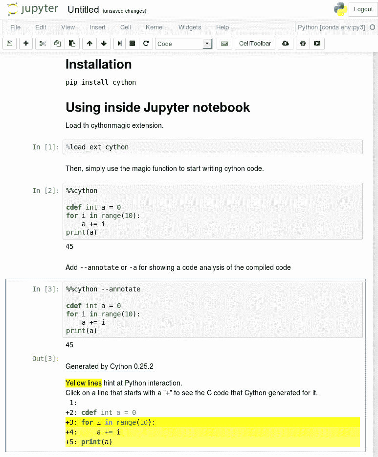
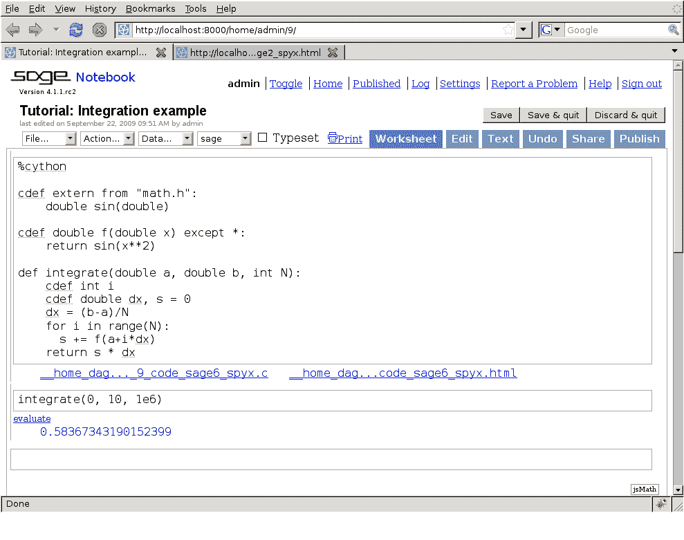

# 构建 Cython 代码

> 原文： [http://docs.cython.org/en/latest/src/quickstart/build.html](http://docs.cython.org/en/latest/src/quickstart/build.html)

与 Python 不同，Cython 代码必须编译。这发生在两个阶段：

> *    `.pyx`文件由 Cython 编译为`.c`文件，它含有 Python 扩展模块的代码。
> *   `.c`文件由 C 编译器编译为`.so`文件（或 Windows 上的`.pyd`），可直接被`import`引入到 一个Python会话中. Distutils 或 setuptools 负责这部分。虽然 Cython 可以在某些情况下为你调用它们。

要完全理解 Cython + distutils / setuptools 构建过程，可能需要阅读更多关于[分发 Python 模块](https://docs.python.org/3/distributing/index.html)的内容。

有几种方法可以构建 Cython 代码：

> *   写一个 distutils / setuptools `setup.py`。这是正常和推荐的方式。
> *   使用 [Pyximport](../userguide/source_files_and_compilation.html#pyximport)，导入 Cython `.pyx`文件就像它们是`.py`文件一样（使用 distutils 在后台编译和构建）。这种方法比编写`setup.py`更容易，但不是很灵活。因此，如果您需要某些编译选项，则需要编写`setup.py`。
> *   手动运行`cython`命令行工具程序来将`.pyx`文件编译生成`.c`文件，然后手动将`.c`文件编译成适合从 Python 导入的共享库或 DLL。（这些手动步骤主要用于调试和实验。）
> *   使用 [[Jupyter]](#jupyter) 笔记本或 [[Sage]](install.html#sage) 笔记本，两者都允许 Cython 代码内联。这是开始编写 Cython 代码并运行它的最简单方法。

目前，使用 distutils 或 setuptools 是构建和分发 Cython 文件的最常用方式。其他方法在参考手册的 [源文件和编译](../userguide/source_files_and_compilation.html#compilation) 部分中有更详细的描述。

## 使用 distutils 构建 一个Cython 模块

想象一下文件`hello.pyx`中的一个简单的“hello world”脚本：

```py
def say_hello_to(name):
    print("Hello %s!" % name)

```

以下是相应的`setup.py`脚本：

```py
from distutils.core import setup
from Cython.Build import cythonize

setup(name='Hello world app',
      ext_modules=cythonize("hello.pyx"))

```

要构建，请运行`python setup.py build_ext --inplace`。然后只需启动一个 Python 会话并执行`from hello import say_hello_to`并根据需要使用导入的函数。

如果您使用 setuptools 而不是 distutils，则需要注意，运行`python setup.py install`时的默认操作是创建一个压缩的`egg`文件，当您尝试从依赖包中使用它们时，这些文件无法与`pxd`文件一起用于`pxd`文件。为防止这种情况，请在`setup()`的参数中包含`zip_safe=False`。

## 使用Jupyter笔记本来构建

Cython 可以通过 Web 浏览器通过 Jupyter 笔记本方便地和交互式地使用。要安装 Jupyter 笔记本，例如进入 virtualenv，使用 pip：

```py
(venv)$ pip install jupyter
(venv)$ jupyter notebook

```

要启用对 Cython 编译的支持，请按照 [安装指南](install.html#install) 中的说明安装 Cython，并从 Jupyter 笔记本中加载`Cython`扩展：

```py
%load_ext Cython

```

然后，使用`%%cython`标记为单元格添加前缀以进行编译：

```py
%%cython

cdef int a = 0
for i in range(10):
    a += i
print(a)

```

您可以通过传递`--annotate`选项来显示 Cython 的代码分析：

```py
%%cython --annotate
...

```



有关`%%cython`魔法参数的更多信息，请参阅 [使用 Jupyter 笔记本](../userguide/source_files_and_compilation.html#compiling-notebook) 进行编译。

## 使用 Sage 笔记本



对于 Sage 数学发行版的用户，Sage 笔记本允许通过在单元格顶部键入`%cython`并进行评估来透明地编辑和编译 Cython 代码。导入到运行会话中的 Cython 单元格中定义的变量和函数。


>  [[Jupyter]](#id1)  [https://jupyter.org/](https://jupyter.org/) 