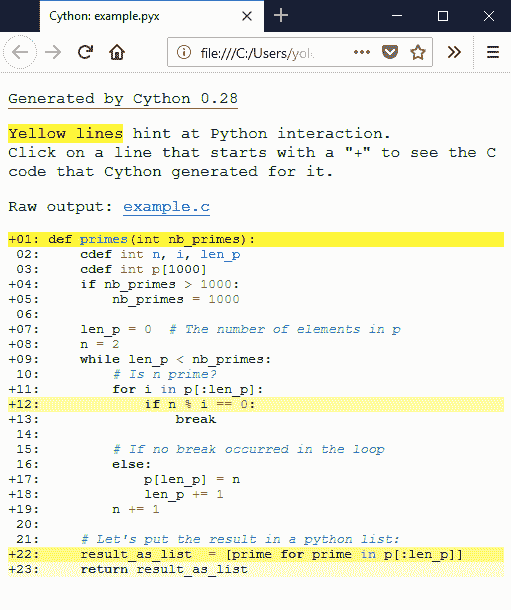
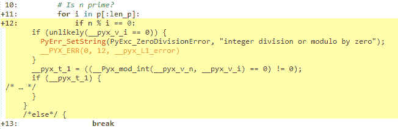

# 基础教程

> 原文： [http://docs.cython.org/en/latest/src/tutorial/cython_tutorial.html](http://docs.cython.org/en/latest/src/tutorial/cython_tutorial.html)

## Cython基础

Cython 的本质可归纳为：Cython 是具有 C 数据类型的 Python。

Cython 是 Python：几乎任何 Python 代码都是有效的 Cython 代码。 （有一些 [限制](docs/34.md) ，目前还只是“几乎”）Cython 编译器将其转换为 C 代码，它对 Python / C API 进行等效调用。（译者注：目标是完全兼容）

但 Cython 远不止于此，因为参数和变量可以声明为具有 C 数据类型。操作 Python 值和 C 值的代码可以自由混合，只要有可能就会自动进行转换。 Python 操作的引用计数维护和错误检查也是自动的，并且即使在操作 C 数据的过程中，您也可以使用 Python 的异常处理工具（包括 try-except 和 try-finally 语句）的全部功能。

## Cython Hello World

由于 Cython 几乎可以接受任何有效的 python 源文件，因此入门中最困难的事情之一就是弄清楚如何编译你的扩展模块。

所以让我们从规范的 python hello-world开始：

```py
print("Hello World")

```

将此代码保存在名为`helloworld.pyx`的文件中。现在我们需要创建`setup.py`，它就像一个 python Makefile（有关更多信息，请参阅 [源文件和编译](docs/29.md) ）。你的`setup.py`看起来像：

```py
from distutils.core import setup
from Cython.Build import cythonize

setup(
    ext_modules = cythonize("helloworld.pyx")
)

```

要使用它来构建您的 Cython 文件，请使用命令行选项：

```sh
$ python setup.py build_ext --inplace

```

在unix中，这将在您的本地目录中创建 `helloworld.so` （Windows 中为 `helloworld.pyd` ）。现在使用这个文件：启动 python 解释器并简单地导入它就好像它是一个普通的 python 模块：

```py
>>> import helloworld
Hello World

```

恭喜！您现在知道如何构建 Cython 扩展。但到目前为止，这个例子并没有真正让人感觉为什么会想要使用 Cython，所以让我们创建一个更现实的例子。

### `pyximport`：面向开发人员的 Cython 编译

如果您的模块不需要任何额外的 C 库或特殊的构建设置，那么您可以使用最初由 Paul Prescod 开发的 pyximport 模块在导入时直接加载.pyx 文件，而无需在每次你修改完代码之后运行`setup.py`。它随 Cython 一起发布和安装，可以像这样使用：

```py
>>> import pyximport; pyximport.install()
>>> import helloworld
Hello World

```

[Pyximport](docs/29.md#用pyximport-编译) 模块还具有对普通 Python 模块的实验性编译支持。这允许您在 Py​​thon 导入的每个.pyx 和.py 模块上自动运行 Cython，包括标准库和已安装的软件包。 Cython 仍然无法编译很多 Python 模块，在这种情况下，导入机制将回退到加载 Python 源模块。 .py 导入机制安装如下：

```py
>>> pyximport.install(pyimport=True)

```

请注意，建议不要让 [Pyximport](docs/29.md#用pyximport-编译)在最终用户端构建代码，因为它会挂钩到他们的导入系统。满足最终用户的最佳方式是以[wheel包](https://wheel.readthedocs.io/)的格式提供预先构建的二进制包。

## 斐波那契函数的乐趣

官方 Python 教程中有一个简单的 fibonacci 函数，定义为：

```py
from __future__ import print_function

def fib(n):
    """Print the Fibonacci series up to n."""
    a, b = 0, 1
    while b < n:
        print(b, end=' ')
        a, b = b, a + b

    print()

```

现在按照 Hello World 示例的步骤，我们首先将文件重命名为 *pyx* 扩展名(假设是 `fib.pyx` )，然后我们创建 `setup.py` 文件。使用为 Hello World 示例创建的文件，您需要更改的是 Cython 文件名的名称，以及生成的模块名称，我们这样做：

```py
from distutils.core import setup
from Cython.Build import cythonize

setup(
    ext_modules=cythonize("fib.pyx"),
)

```

使用与 helloworld.pyx 相同的命令构建扩展模块：

```sh
$ python setup.py build_ext --inplace

```

并使用新的扩展模块：

```py
>>> import fib
>>> fib.fib(2000)
1 1 2 3 5 8 13 21 34 55 89 144 233 377 610 987 1597

```

## 素数

这是一个小例子，展示了一些可以做的事情。这是查找素数的例程。你告诉它你想要多少素数，并将它们作为 Python 列表返回。

`primes.pyx`：


```python
 def primes(int nb_primes):
    cdef int n, i, len_p
    cdef int p[1000]
    if nb_primes > 1000:
        nb_primes = 1000

    len_p = 0  # The current number of elements in p.
    n = 2
    while len_p < nb_primes:
        # Is n prime?
        for i in p[:len_p]:
            if n % i == 0:
                break

        # If no break occurred in the loop, we have a prime.
        else:
            p[len_p] = n
            len_p += 1
        n += 1

    # Let's return the result in a python list:
    result_as_list  = [prime for prime in p[:len_p]]
    return result_as_list
```


您将看到它的开始就像普通的 Python 函数定义一样，除了参数 `nb_primes` 被声明为 `int` 类型。这意味着传递的对象将被转换为 C 整数（如果不能，则会引发`TypeError.`）。

现在，让我们深入研究该函数的核心：

```py
cdef int n, i, len_p
cdef int p[1000]

```

第 2 行和第 3 行使用 `cdef` 语句定义一些本地 C 变量。结果在处理期间存储在 C 数组`p`中，并将在末尾复制到 Python 列表中（第 22 行）。

> 注意：您不能以这种方式创建非常大的数组，因为它们是在 C 函数调用堆栈上分配的，这是一个相当珍贵和稀缺的资源。要请求更大的数组，甚至是只在运行时知道长度的数组，您可以学习如何在Cython中有效地使用 [C 内存分配](docs/16.md) ， [Python 数组](docs/19.md) 或 [NumPy 数组](docs/36.md)。

```py
if nb_primes > 1000:
    nb_primes = 1000

```

与在 C 中一样，声明静态数组需要在编译时知道大小。我们确保用户没有设置大于 1000 的值（或者我们会有一个分段错误，就像在 C 中一样）。

```py
len_p = 0  # The number of elements in p
n = 2
while len_p < nb_primes:

```

第 11-13 行设置了一个循环，它将测试候选数字的完整性，直到找到所需的素数。

```py
# Is n prime?
for i in p[:len_p]:
    if n % i == 0:
        break

```

第15-16行，尝试将候选的数字除以迄今为止发现的所有素数非常重要。因为没有引用 Python 对象，所以循环完全转换为 C 代码，因此运行速度非常快。你会注意到我们迭代`p` C 数组的方式。

```py
for i in p[:len_p]:

```

循环被转换为快速 C 循环，就像迭代 Python 列表或 NumPy 数组一样。如果不使用`[:len_p]`对 C 数组进行切片，则 Cython 将循环遍历数组的 1000 个元素。

```py
# If no break occurred in the loop
else:
    p[len_p] = n
    len_p += 1
n += 1

```

如果没有发生中断，则意味着我们找到了一个素数，并且将在 `else` 之后的第20行之后的代码块。我们添加了`p`找到的素数。如果你发现在 for 循环奇怪之后有`else`，只要知道它是 Python 语言鲜为人知的特性，并且 Cython 会以 C 速度为你执行它。如果 for-else 语法让您感到困惑，请参阅这篇优秀的[博客文章](https://shahriar.svbtle.com/pythons-else-clause-in-loops)。

```py
# Let's put the result in a python list:
result_as_list  = [prime for prime in p[:len_p]]
return result_as_list

```

在第 26 行，在返回结果之前，我们需要将 C 数组复制到 Python 列表中，因为 Python 无法读取 C 数组。 Cython 可以自动将许多 C 类型转换为 Python 类型，如 [类型转换](docs/24.md#类型转换) 的文档中所述，因此我们可以使用简单的列表解析来复制 C `int`值到存储 Python `int`对象的 Python 列表中，Cython 在此过程中自动创建。您也可以在 C 数组上手动迭代并使用`result_as_list.append(prime)`，结果将是相同的。

您会注意到我们声明 Python 列表的方式与 Python 中的完全相同。因为变量`result_as_list`尚未使用类型显式声明，所以假定它包含一个 Python 对象，并且从赋值中，Cython 也知道确切的类型是 Python 列表。

最后，在第 27 行，普通的 Python return 语句返回结果列表。

使用 Cython 编译器编译 primes.pyx 会生成一个扩展模块，我们可以在交互式解释器中尝试如下：

```py
>>> import primes
>>> primes.primes(10)
[2, 3, 5, 7, 11, 13, 17, 19, 23, 29]

```

看，它有效！如果您对 Cython 为您节省了多少工作感到好奇，请查看为此模块生成的 C 代码。

Cython 有一种方法可视化与 Python 对象和 Python 的 C-API 进行交互的位置。为此，将`annotate=True`参数传递给`cythonize()`。它生成一个 HTML 文件。让我们来看看：



如果一行为白色，则表示生成的代码不与 Python 交互，因此将以与普通 C 代码一样快的速度运行。黄色越深，该行中的 Python 交互越多。这些黄色线通常可以在 Python 对象上运行，引发异常，或执行其他类型的高级操作，而不是可以轻松转换为简单快速的 C 代码。函数声明和返回使用 Python 解释器，因此这些行是黄色的。列表推导也是如此，因为它涉及创建 Python 对象。但行`if n % i == 0:`，为什么？我们可以检查生成的 C 代码来理解：



我们可以看到一些检查发生。因为 Cython 默认使用 Python 行为，所以语言将在运行时执行除法检查，就像 Python 一样。您可以使用 [编译器指令](docs/29.md#编译器指令) 来取消这些检查。

现在让我们看看，即使我们有除法检查，我们也提升了速度。让我们编写相同的程序，但是用 Python 风格：

```py
def primes_python(nb_primes):
    p = []
    n = 2
    while len(p) < nb_primes:
        # Is n prime?
        for i in p:
            if n % i == 0:
                break

        # If no break occurred in the loop
        else:
            p.append(n)
        n += 1
    return p

```

也可以采用普通的`.py`文件（未使用注解）并使用 Cython 进行编译。让我们拿`primes_python`，将函数名改为`primes_python_compiled`并用 Cython 编译（不改变代码）。我们还将文件名更改为`example_py_cy.py`，以区别于其他文件。现在`setup.py`看起来像这样：

```py
from distutils.core import setup
from Cython.Build import cythonize

setup(
    ext_modules=cythonize(['example.pyx',        # Cython code file with primes() function
                           'example_py_cy.py'],  # Python code file with primes_python_compiled() function
                          annotate=True),        # enables generation of the html annotation file
)

```

现在我们可以确保这两个程序输出相同的值：

```py
>>> primes_python(1000) == primes(1000)
True
>>> primes_python_compiled(1000) == primes(1000)
True

```

现在可以比较速度：

```py
python -m timeit -s 'from example_py import primes_python' 'primes_python(1000)'
10 loops, best of 3: 23 msec per loop

python -m timeit -s 'from example_py_cy import primes_python_compiled' 'primes_python_compiled(1000)'
100 loops, best of 3: 11.9 msec per loop

python -m timeit -s 'from example import primes' 'primes(1000)'
1000 loops, best of 3: 1.65 msec per loop

```

`primes_python`的 cythonize 版本比 Python 版本快 2 倍，而不需要更改单行代码。 Cython 版本比 Python 版本快 13 倍！有什么可以解释这个？

几件事:

*   在这个程序中，每行都进行很少的计算。因此 python 解释器的开销非常重要。如果你要在每一行做很多计算，那将会非常不同。以 NumPy 为例。
*   数据局部性。使用 C 时，使用 Python 时可能会有更多的内容适合 CPU 缓存。因为 python 中的所有内容都是一个对象，并且每个对象都是作为字典实现的，所以这不是很容易缓存的。

通常加速比在 2x 到 1000x 之间。这取决于你调用 Python 解释器的程度。与往常一样，请记住在到处添加类型之前进行性能测试，添加类型会降低代码的可读性，因此请谨慎使用它们。

## 使用 C ++ 语言

使用 Cython，也可以利用 C ++语言，特别是 C ++标准库的一部分可以直接从 Cython 代码导入。

让我们看看当使用 C ++标准库中的[向量](https://en.cppreference.com/w/cpp/container/vector)时我们的`primes.pyx`变成了什么。

> 注意: C ++中的 Vector 是一种数据结构，它基于可调整大小的 C 数组实现列表或堆栈。它类似于`array`标准库模块中的 Python `array`类型。有一个 *reserve* 方法可以在如果你事先知道你要在矢量中放入多少元素时避免复制。有关详细信息，请参阅 cppreference 中的[此页面。](https://en.cppreference.com/w/cpp/container/vector)


```py
# distutils: language=c++

from libcpp.vector cimport vector

def primes(unsigned int nb_primes):
    cdef int n, i
    cdef vector[int] p
    p.reserve(nb_primes)  # allocate memory for 'nb_primes' elements.

    n = 2
    while p.size() < nb_primes:  # size() for vectors is similar to len()
        for i in p:
            if n % i == 0:
                break
        else:
            p.push_back(n)  # push_back is similar to append()
        n += 1

    # Vectors are automatically converted to Python
    # lists when converted to Python objects.
    return p

```

第一行是编译器指令。它告诉 Cython 将您的代码编译为 C ++。这将允许使用 C ++语言功能和 C ++标准库。请注意，使用 *pyximport* 无法将 Cython 代码编译为 C ++。您应该使用`setup.py`或Notebook来运行此示例。

您可以看到向量的 API 类似于 Python 列表的 API，有时可以用作 Cython 中的替代品。

有关在 Cython 中使用 C ++的更多详细信息，请参阅 [在Cython中使用 C ++](docs/31.md)。

## 语言详细信息

有关 Cython 语言的更多信息，请参阅 [语言基础](docs/24.md) 。要深入研究如何在数值计算的场景中使用 Cython，请参阅 [类型化的内存视图](docs/36.md) 。
